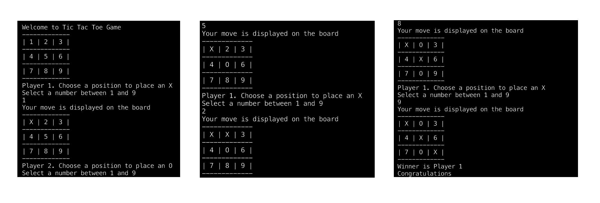

# Ruby Project: Tic Tac Toe Game

This is a Ruby implementation of the popular Tic Tac Toe game.
A player wins the game by placing 3 symbols (either X or O) in line.

## Built With

- Ruby,
- Rubocop

## Getting Started

To get a local copy up and running follow these simple example steps:

- Clone the project from [here](https://github.com/pbkabali/Tic-Tac-Toe)

### Prerequisites

- Ruby 2.7.x
- Terminal

### Setup

Navigate to the root folder.
Run `./bin/main.rb`

### Install

#### Ruby:
To install Ruby go to this [page](https://www.ruby-lang.org/en/) and follow the instructions given.

#### Rubocop:
Run `gem install rubocop`

### Usage (Game instructions)

- First run `./bin/main.rb` in the terminal being in the root folder.
- You will see the welcome screen and the default appearance of the board.
- The first player will be prompted to place an "X" on the board using numbers between 1 and 9.
- After the selection, the updated board will be displayed with the placed "X".
- Now the second player will be prompted to place an "O" on the board using numbers between 1 and 9 but only the available positions.
- After the selection, the updated board will be displayed with the placed "O".
- The players will continue entering selections in turns until there is a winner or the game ends in a draw.
- The winner will be the first player who places three symbols in a line. The line could be horizontal, vertical or diagonal.

## Authors

👤 **Paul Balitema Kabali**

- Github: [@pbkabali](https://github.com/pbkabali)
- Twitter: [@pbkabali](https://twitter.com/pbkabali)
- Linkedin: [engineerbpk](https://linkedin.com/in/engineerbpk)

👤 **Jhonatan Sarrazola**

- Github: [@jssarrazolaa](https://github.com/jssarrazolaa)
- Twitter: [@StevenAlvarez_](https://twitter.com/StevenAlvarez_)
- Linkedin: [Jhonatan Sarrazola](https://www.linkedin.com/in/jhonatan-sarrazola-6a46a01a5/)

## 🤝 Contributing

Contributions, issues and feature requests are welcome!

Feel free to check the [issues page](https://github.com/pbkabali/Tic-Tac-Toe/issues).

## Show your support

Give a ⭐️ if you like this project!

## Acknowledgments

- Microverse team 140 - The Cupids
- Microverse team 138 - The Atlas
- The odin project

## 📝 License

This project is [MIT](https://opensource.org/licenses/MIT) licensed.
